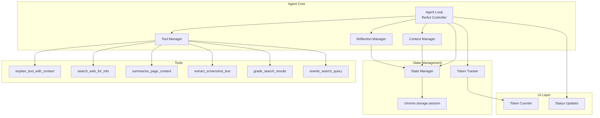
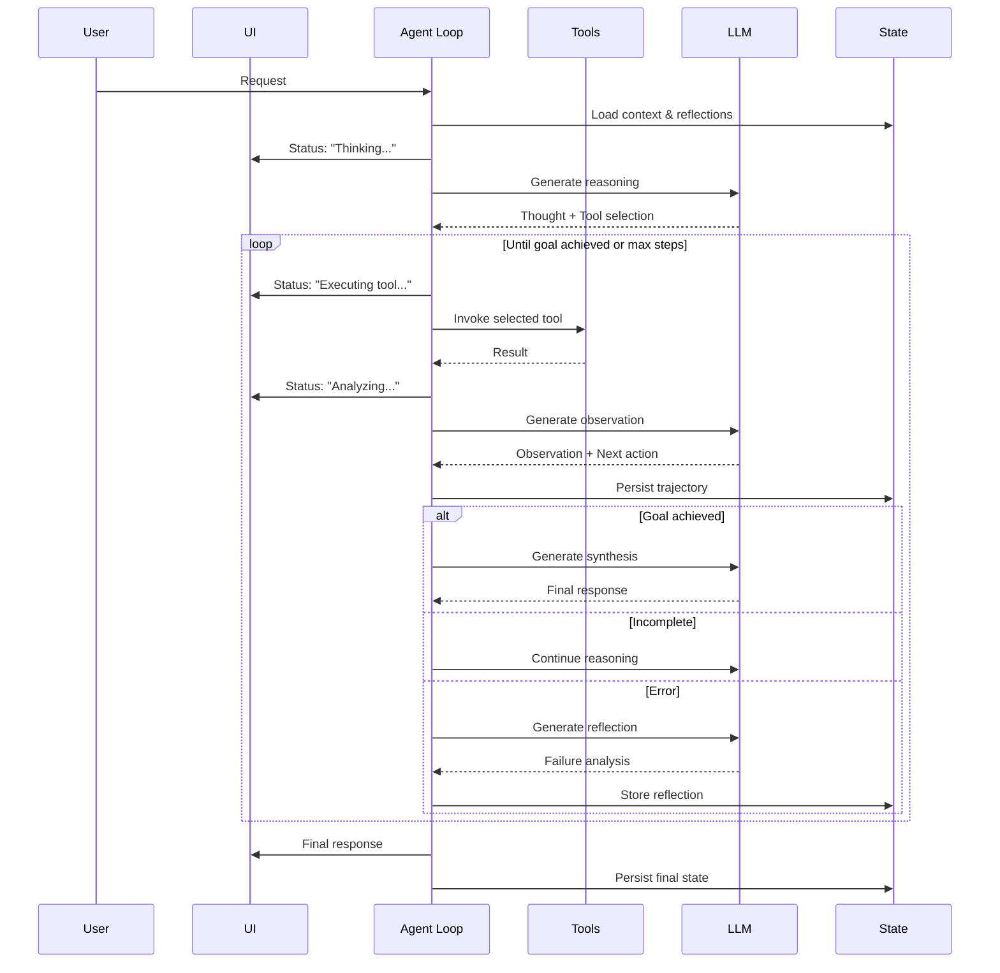

# Design Document: Agent Architecture Upgrade

## Overview

This design document describes the architectural upgrade of KnowledgeLens from a simple request-response pattern to a modern agentic architecture. The upgrade introduces:

1. **ReAct Control Loop** - Explicit reasoning before action with observation feedback
2. **Structured Tool System** - JSON schema-based tool definitions with validation
3. **Reflexion Pattern** - Self-correction through failure analysis and episodic memory
4. **Agentic RAG** - Search with result grading and query rewriting
5. **Context Engineering** - Compaction, grounding, and efficient state management
6. **State Persistence** - Service Worker resilience via chrome.storage.session

### Key Design Decisions

1. **Single-Agent Architecture**: Start with a single agent with multiple tools rather than multi-agent orchestration. This simplifies debugging and reduces latency.

2. **Streaming Status Updates**: All agentic operations stream status updates to the UI to maintain user engagement during multi-step processing.

3. **Bounded Execution**: Hard limits on loop iterations (5 steps) and retries (3 attempts) prevent runaway costs.

4. **Immediate State Persistence**: All state changes are persisted to chrome.storage.session to survive Service Worker hibernation.

5. **Token Budget Awareness**: Every operation estimates and tracks token consumption with user-configurable thresholds.

## Architecture



### ReAct Loop Flow



## Components and Interfaces

### 1. Agent Loop (`src/lib/agent/loop.ts`)

The core ReAct controller that orchestrates reasoning, tool execution, and observation.

```typescript
interface AgentConfig {
  maxSteps: number;           // Default: 5
  maxRetries: number;         // Default: 3
  tokenBudget: number;        // User-configurable
  llmConfig: LLMConfig;
}

interface AgentStep {
  stepNumber: number;
  timestamp: number;
  type: 'thought' | 'action' | 'observation' | 'reflection' | 'synthesis';
  content: string;
  toolCall?: ToolCall;
  toolResult?: ToolResult;
  tokenCount: number;
}

interface AgentTrajectory {
  requestId: string;
  goal: string;
  steps: AgentStep[];
  status: 'running' | 'completed' | 'failed' | 'terminated';
  totalTokens: { input: number; output: number };
  efficiency?: number;  // optimal steps / actual steps
}

type StatusCallback = (status: AgentStatus) => void;

interface AgentStatus {
  phase: 'thinking' | 'executing' | 'analyzing' | 'reflecting' | 'synthesizing';
  stepNumber: number;
  maxSteps: number;
  tokenUsage: { input: number; output: number };
  currentTool?: string;
}

// Main agent loop function
async function runAgentLoop(
  goal: string,
  context: AgentContext,
  config: AgentConfig,
  onStatus: StatusCallback,
  signal?: AbortSignal
): Promise<AgentTrajectory>;

// Check if goal is achieved based on observation
function isGoalAchieved(observation: string, goal: string): boolean;

// Determine if we should continue or terminate
function shouldContinue(trajectory: AgentTrajectory, config: AgentConfig): boolean;
```

### 2. Tool Manager (`src/lib/agent/tools.ts`)

Manages tool definitions, validation, and invocation.

```typescript
interface ToolSchema {
  name: string;
  description: string;
  parameters: JSONSchema;
  examples: ToolExample[];
}

interface ToolExample {
  input: Record<string, unknown>;
  description: string;
}

interface ToolCall {
  name: string;
  parameters: Record<string, unknown>;
  reasoning: string;  // Why this tool was selected
}

interface ToolResult {
  success: boolean;
  data?: unknown;
  error?: string;
  tokenCount: number;
}

// Tool registry
const toolRegistry: Map<string, ToolSchema>;

// Register a new tool
function registerTool(schema: ToolSchema, handler: ToolHandler): void;

// Get tool schema for LLM prompt
function getToolSchemas(): ToolSchema[];

// Validate tool call against schema
function validateToolCall(call: ToolCall): ValidationResult;

// Execute tool with validation
async function executeTool(call: ToolCall): Promise<ToolResult>;

// Parse tool call from LLM output
function parseToolCall(llmOutput: string): ToolCall | null;

// Serialize tool call to string
function serializeToolCall(call: ToolCall): string;
```

### 3. Reflection Manager (`src/lib/agent/reflection.ts`)

Handles failure analysis and episodic memory for self-correction.

```typescript
interface Reflection {
  id: string;
  timestamp: number;
  errorType: string;
  failedAction: ToolCall;
  analysis: string;
  suggestedFix: string;
  applied: boolean;
}

interface EpisodicMemory {
  sessionId: string;
  reflections: Reflection[];
  errorCounts: Map<string, number>;  // Track repeated errors
}

// Generate reflection from failure
async function generateReflection(
  failedAction: ToolCall,
  error: string,
  context: AgentContext,
  llmConfig: LLMConfig
): Promise<Reflection>;

// Get relevant reflections for current action
function getRelevantReflections(
  action: ToolCall,
  memory: EpisodicMemory
): Reflection[];

// Check if error type has occurred before
function isRepeatedError(errorType: string, memory: EpisodicMemory): boolean;

// Suggest alternative approach for repeated errors
async function suggestAlternative(
  failedAction: ToolCall,
  memory: EpisodicMemory,
  llmConfig: LLMConfig
): Promise<ToolCall>;
```

### 4. Context Manager (`src/lib/agent/context.ts`)

Manages context window, compaction, and grounding.

```typescript
interface AgentContext {
  grounding: GroundingSection;
  history: ContextEntry[];
  reflections: Reflection[];
  tokenCount: number;
  maxTokens: number;
}

interface GroundingSection {
  currentGoal: string;
  completedSubtasks: string[];
  keyDecisions: string[];
  userPreferences: Record<string, string>;
}

interface ContextEntry {
  type: 'user' | 'assistant' | 'tool' | 'observation';
  content: string;
  timestamp: number;
  tokenCount: number;
  compacted: boolean;
}

// Create initial context with grounding
function createContext(goal: string, maxTokens: number): AgentContext;

// Add entry to context
function addToContext(context: AgentContext, entry: ContextEntry): AgentContext;

// Check if compaction is needed (>80% capacity)
function needsCompaction(context: AgentContext): boolean;

// Compact context while preserving key information
async function compactContext(
  context: AgentContext,
  llmConfig: LLMConfig
): Promise<AgentContext>;

// Generate grounding section for new cycle
function generateGrounding(context: AgentContext): string;

// Serialize context for LLM prompt
function serializeContext(context: AgentContext): string;
```

### 5. State Manager (`src/lib/agent/state.ts`)

Handles persistence to chrome.storage.session for Service Worker resilience.

```typescript
interface AgentState {
  sessionId: string;
  trajectory: AgentTrajectory | null;
  context: AgentContext;
  memory: EpisodicMemory;
  tokenUsage: TokenUsage;
  lastUpdated: number;
}

interface TokenUsage {
  sessionTotal: { input: number; output: number };
  currentOperation: { input: number; output: number };
  budget: number;
  warningThreshold: number;
}

// Save state to chrome.storage.session
async function saveState(state: AgentState): Promise<void>;

// Load state from chrome.storage.session
async function loadState(sessionId: string): Promise<AgentState | null>;

// Clear session state
async function clearState(sessionId: string): Promise<void>;

// Create new session
function createSession(): AgentState;

// Check if state restoration succeeded
function isValidState(state: unknown): state is AgentState;
```

### 6. Agentic RAG (`src/lib/agent/rag.ts`)

Search with result grading and query rewriting.

```typescript
interface GradedResult {
  result: SearchResult;
  relevance: 'relevant' | 'not_relevant';
  confidence: number;
  reasoning: string;
}

interface RAGConfig {
  maxRetries: number;        // Default: 2
  relevanceThreshold: number; // Default: 0.5 (50% must be relevant)
}

// Grade search results for relevance
async function gradeResults(
  results: SearchResult[],
  query: string,
  context: string,
  llmConfig: LLMConfig
): Promise<GradedResult[]>;

// Rewrite query for better results
async function rewriteQuery(
  originalQuery: string,
  failedResults: GradedResult[],
  llmConfig: LLMConfig
): Promise<string>;

// Execute agentic RAG with self-correction
async function agenticRAG(
  query: string,
  context: string,
  config: RAGConfig,
  llmConfig: LLMConfig,
  searchConfig: SearchConfig,
  onStatus: StatusCallback
): Promise<RAGResult>;

interface RAGResult {
  relevantResults: GradedResult[];
  queryHistory: string[];  // Original + rewrites
  fallbackUsed: boolean;
  disclaimer?: string;
}
```

### 7. Prompt Templates (`src/lib/agent/prompts.ts`)

Structured prompt templates with validation.

```typescript
interface PromptTemplate {
  name: string;
  sections: PromptSection[];
  placeholders: PlaceholderDef[];
}

interface PromptSection {
  name: string;
  delimiter: 'xml' | 'markdown';
  content: string;
  required: boolean;
}

interface PlaceholderDef {
  name: string;
  type: 'string' | 'array' | 'object';
  required: boolean;
}

// Load and validate template
function loadTemplate(name: string): PromptTemplate;

// Validate template has required sections
function validateTemplate(template: PromptTemplate): ValidationResult;

// Inject context into template
function renderTemplate(
  template: PromptTemplate,
  context: Record<string, unknown>
): string;

// Parse template from string
function parseTemplate(content: string): PromptTemplate;

// Serialize template to string
function serializeTemplate(template: PromptTemplate): string;

// Pre-defined templates
const TEMPLATES = {
  REACT_SYSTEM: PromptTemplate;
  REFLECTION: PromptTemplate;
  RESULT_GRADING: PromptTemplate;
  QUERY_REWRITE: PromptTemplate;
  CONTEXT_COMPACTION: PromptTemplate;
};
```

### 8. Token Tracker (`src/lib/agent/tokens.ts`)

Tracks and estimates token consumption.

```typescript
interface TokenEstimate {
  input: number;
  output: number;
  total: number;
  cost?: number;  // If pricing is configured
}

// Estimate tokens for an operation
function estimateTokens(
  prompt: string,
  expectedOutputLength: number,
  encoding?: TokenizerEncoding
): TokenEstimate;

// Track actual token usage
function trackUsage(
  usage: TokenUsage,
  actual: { input: number; output: number }
): TokenUsage;

// Check if budget exceeded
function isBudgetExceeded(usage: TokenUsage): boolean;

// Check if warning threshold reached
function isWarningThreshold(usage: TokenUsage): boolean;

// Format usage for display
function formatUsage(usage: TokenUsage): string;
```

### 9. Trajectory Logger (`src/lib/agent/logger.ts`)

Logs agent execution for observability.

```typescript
interface TrajectoryLog {
  requestId: string;
  entries: LogEntry[];
  metrics: TrajectoryMetrics;
}

interface LogEntry {
  timestamp: number;
  stepNumber: number;
  type: 'thought' | 'tool_call' | 'tool_result' | 'observation' | 'reflection' | 'error';
  content: string;
  metadata?: Record<string, unknown>;
}

interface TrajectoryMetrics {
  totalSteps: number;
  optimalSteps?: number;
  efficiency?: number;
  totalTokens: { input: number; output: number };
  duration: number;
  errorCount: number;
}

// Log a step
function logStep(log: TrajectoryLog, entry: Omit<LogEntry, 'timestamp'>): void;

// Calculate trajectory efficiency
function calculateEfficiency(log: TrajectoryLog, optimalSteps: number): number;

// Export log for debugging
function exportLog(log: TrajectoryLog): string;
```

## Data Models

### Agent State Models

```typescript
// Complete agent state for persistence
interface PersistedAgentState {
  version: number;  // For migration
  sessionId: string;
  trajectory: AgentTrajectory | null;
  context: SerializedContext;
  memory: SerializedMemory;
  tokenUsage: TokenUsage;
  timestamp: number;
}

// Serialized context (for storage)
interface SerializedContext {
  grounding: GroundingSection;
  history: ContextEntry[];
  reflections: string[];  // Reflection IDs
  tokenCount: number;
}

// Serialized memory (for storage)
interface SerializedMemory {
  sessionId: string;
  reflections: Reflection[];
  errorCounts: [string, number][];  // Map as array
}
```

### UI State Models

```typescript
// Agent status for UI display
interface AgentUIState {
  isRunning: boolean;
  currentPhase: AgentStatus['phase'] | 'idle';
  stepProgress: { current: number; max: number };
  tokenUsage: { input: number; output: number; budget: number };
  currentTool?: string;
  lastError?: string;
  warnings: string[];
}

// Status update event
interface StatusUpdateEvent {
  type: 'phase_change' | 'step_complete' | 'token_update' | 'warning' | 'error';
  payload: AgentStatus | string;
}
```

## Correctness Properties

*A property is a characteristic or behavior that should hold true across all valid executions of a system-essentially, a formal statement about what the system should do. Properties serve as the bridge between human-readable specifications and machine-verifiable correctness guarantees.*

Based on the prework analysis, the following correctness properties must be validated:

### Property 1: Bounded Execution
*For any* agent execution, the total number of steps SHALL NOT exceed the configured maxSteps (default 5), and the total number of retries for any single action SHALL NOT exceed maxRetries (default 3).
**Validates: Requirements 1.7, 3.5**

### Property 2: Reasoning Before Action
*For any* tool invocation in the agent loop, there SHALL exist a preceding thought step that contains reasoning for the tool selection.
**Validates: Requirements 1.1, 1.2**

### Property 3: Observation After Action
*For any* tool result in the agent loop, there SHALL exist a subsequent observation step that analyzes whether the result meets the goal.
**Validates: Requirements 1.3**

### Property 4: Tool Definition Round-Trip
*For any* valid tool definition, serializing it to JSON and parsing it back SHALL produce an equivalent tool definition structure.
**Validates: Requirements 2.5, 2.6**

### Property 5: Tool Validation Rejects Invalid Input
*For any* tool call with parameters that violate the schema, the validation function SHALL return an error with a descriptive message.
**Validates: Requirements 2.4**

### Property 6: Reflection Storage
*For any* failed action that triggers reflection, the generated reflection SHALL be stored in episodic memory and retrievable for subsequent retries.
**Validates: Requirements 3.2, 3.3**

### Property 7: Search Result Grading
*For any* set of search results, the grading function SHALL assign a relevance grade ('relevant' or 'not_relevant') to each result.
**Validates: Requirements 4.1**

### Property 8: Query Rewriting on Low Relevance
*For any* search where the majority of results are graded 'not_relevant', the system SHALL generate a rewritten query that differs from the original.
**Validates: Requirements 4.2, 4.3**

### Property 9: Citation Integrity
*For any* final response that includes citations, all cited sources SHALL have been graded as 'relevant'.
**Validates: Requirements 4.5**

### Property 10: Context Compaction Reduces Tokens
*For any* context compaction operation, the resulting context token count SHALL be at least 20% smaller than the original.
**Validates: Requirements 5.5**

### Property 11: Grounding Preservation
*For any* context compaction, the grounding section (goal, key decisions, user preferences) SHALL be preserved in the compacted context.
**Validates: Requirements 5.3, 5.4**

### Property 12: State Persistence Round-Trip
*For any* valid agent state, saving it to chrome.storage.session and loading it back SHALL produce an equivalent state object.
**Validates: Requirements 10.1, 10.2**

### Property 13: Trajectory Logging Completeness
*For any* completed agent execution, the trajectory log SHALL contain entries for all thoughts, tool calls, tool results, and observations with timestamps and step numbers.
**Validates: Requirements 7.1, 7.2, 7.3**

### Property 14: Search Fallback Behavior
*For any* search operation that fails after all retries, the system SHALL fall back to LLM-only response with a disclaimer indicating the fallback.
**Validates: Requirements 4.4, 9.1**

### Property 15: Token Budget Enforcement
*For any* agent execution where token usage exceeds the configured budget, the system SHALL terminate and return the best available result.
**Validates: Requirements 11.4**

### Property 16: Prompt Template Round-Trip
*For any* valid prompt template, serializing it to string and parsing it back SHALL produce an equivalent template structure.
**Validates: Requirements 8.5**

### Property 17: Status Update Emission
*For any* phase transition in the agent loop, a status update callback SHALL be invoked with the new phase information.
**Validates: Requirements 1.6**

## Error Handling

### Agent Loop Errors

| Error Type | Handling Strategy |
|------------|-------------------|
| Max steps exceeded | Terminate loop, return best partial result |
| Max retries exceeded | Terminate action, try alternative or return partial |
| Token budget exceeded | Terminate immediately, return partial with warning |
| LLM API error | Retry with exponential backoff, then degrade |
| Tool execution error | Generate reflection, retry with fix |

### State Persistence Errors

| Error Type | Handling Strategy |
|------------|-------------------|
| Storage quota exceeded | Compact state, retry save |
| Storage access denied | Continue without persistence, warn user |
| State corruption | Start fresh session, notify user |
| Serialization error | Log error, attempt recovery |

### RAG Errors

| Error Type | Handling Strategy |
|------------|-------------------|
| Search API failure | Retry once, then fall back to LLM-only |
| All results irrelevant | Rewrite query up to 2 times, then fall back |
| Grading timeout | Use results without grading, add disclaimer |

## Testing Strategy

### Property-Based Testing Library

This project will use **fast-check** for property-based testing in TypeScript.

### Test Configuration

- Minimum 100 iterations per property test
- Each property test must be tagged with: `**Feature: agent-architecture-upgrade, Property {number}: {property_text}**`

### Unit Tests

Unit tests will cover:
- Individual tool handlers
- Prompt template parsing and rendering
- Token counting and estimation
- State serialization/deserialization

### Property-Based Tests

Each correctness property will have a corresponding property-based test:

1. **Bounded execution** (Property 1)
   - Generate random agent configurations and goals
   - Verify step/retry limits are never exceeded

2. **Reasoning before action** (Property 2)
   - Generate random trajectories
   - Verify thought precedes every tool call

3. **Tool definition round-trip** (Property 4)
   - Generate random valid tool schemas
   - Verify serialize/parse preserves structure

4. **Context compaction** (Properties 10, 11)
   - Generate random contexts at various sizes
   - Verify compaction reduces tokens while preserving grounding

5. **State persistence round-trip** (Property 12)
   - Generate random valid agent states
   - Verify save/load preserves all fields

6. **Prompt template round-trip** (Property 16)
   - Generate random valid templates
   - Verify serialize/parse preserves structure

### Integration Tests

Integration tests will verify:
- End-to-end agent loop execution
- State persistence across Service Worker restarts
- RAG with real search API (mocked)
- Token tracking accuracy
