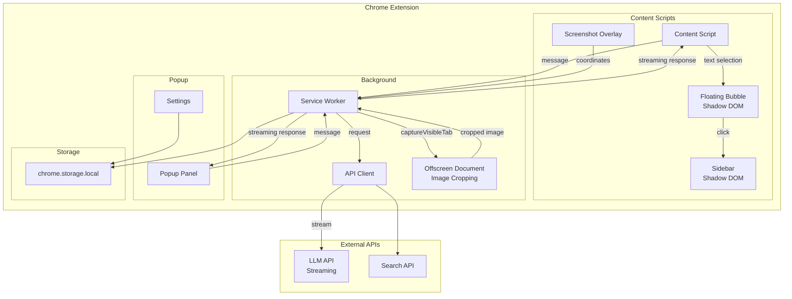
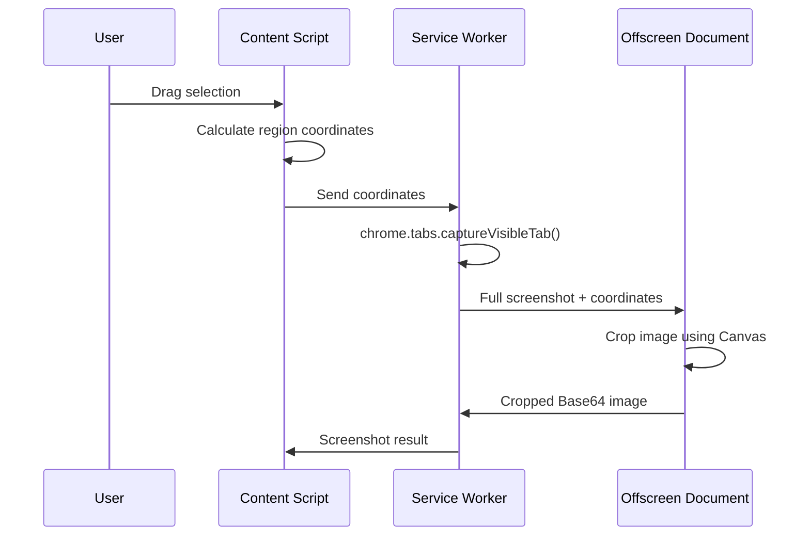

# Design Document: KnowledgeLens

## Overview

KnowledgeLens is a Chrome extension (Manifest V3) that provides AI-powered reading assistance and knowledge management. The extension integrates with web pages through content scripts, communicates with LLM and search APIs via a background service worker, and presents results through a popup panel and in-page sidebar.

The system follows a message-passing architecture where:
- Content scripts handle DOM interactions (text selection, screenshot overlay)
- Background service worker manages API calls and cross-origin requests
- Popup and sidebar components render AI responses with React

### Key Design Decisions

1. **Shadow DOM Isolation**: The Floating Bubble and Sidebar are rendered inside Shadow DOM to prevent host page CSS from breaking extension styles.

2. **Screenshot Pipeline**: Screenshot capture uses `chrome.tabs.captureVisibleTab` in the background service worker, with image cropping performed in an Offscreen Document to avoid blocking the service worker.

3. **Streaming Responses**: LLM API calls support streaming via callback functions to provide real-time feedback during long generations.

4. **Type-Safe Messaging**: Extension messages use discriminated unions for compile-time type safety.

5. **Request Cancellation**: All API calls support AbortController for user-initiated cancellation.

## Architecture



### Screenshot Capture Flow



## Components and Interfaces

### 1. Content Script Module (`src/content/`)

Handles all in-page interactions including text selection detection, floating bubble display, sidebar rendering, and screenshot overlay.

**Shadow DOM Isolation**: Both Floating Bubble and Sidebar are rendered inside Shadow DOM containers to prevent host page CSS from affecting extension UI. This protects against global CSS rules like `div { display: none !important }`.

```typescript
// Shadow DOM container for isolated UI
interface ShadowContainer {
  host: HTMLElement;
  shadow: ShadowRoot;
  render: (component: React.ReactNode) => void;
  destroy: () => void;
}

function createShadowContainer(id: string): ShadowContainer;

// Text selection handler
interface SelectionData {
  text: string;
  context: string;  // 500 chars before + after
  position: { x: number; y: number };
  pageUrl: string;
  pageTitle: string;
}

function getSelectionWithContext(): SelectionData | null;
function showFloatingBubble(position: { x: number; y: number }): void;
function hideFloatingBubble(): void;
function openSidebar(): void;
function closeSidebar(): void;
```

### 2. Screenshot Module (`src/content/screenshot.ts`)

Manages screenshot overlay and region selection. The actual capture and cropping happens in the background.

**Important**: Content scripts cannot directly capture screenshots. The flow is:
1. Content script captures selection coordinates
2. Background service worker calls `chrome.tabs.captureVisibleTab()`
3. Offscreen Document crops the full screenshot using Canvas API
4. Cropped image is returned to content script

```typescript
interface ScreenshotRegion {
  x: number;
  y: number;
  width: number;
  height: number;
  devicePixelRatio: number;  // For high-DPI displays
}

interface ScreenshotResult {
  imageBase64: string;
  region: ScreenshotRegion;
  pageUrl: string;
  pageTitle: string;
  favicon: string;
}

// Content script functions (selection only)
function activateScreenshotMode(): void;
function deactivateScreenshotMode(): void;
function getSelectedRegion(): ScreenshotRegion | null;

// Background service worker function
function captureAndCropScreenshot(region: ScreenshotRegion): Promise<string>;
```

### 2.1 Offscreen Document (`src/offscreen/`)

Handles CPU-intensive image cropping to avoid blocking the service worker.

```typescript
// Offscreen document message handler
interface CropImageMessage {
  action: 'crop_image';
  imageDataUrl: string;
  region: ScreenshotRegion;
}

interface CropImageResponse {
  croppedImageBase64: string;
}

function cropImage(imageDataUrl: string, region: ScreenshotRegion): string;
```

### 3. Background Service Worker (`src/background/`)

Coordinates API calls and message passing between components.

**Type-Safe Messaging**: Uses discriminated unions for compile-time type safety. TypeScript automatically infers payload types in switch statements.

```typescript
// Discriminated union for type-safe message handling
type ExtensionMessage =
  | { action: 'summarize_page'; payload: SummarizePayload }
  | { action: 'explain_text'; payload: ExplainPayload }
  | { action: 'search_enhance'; payload: SearchEnhancePayload }
  | { action: 'capture_screenshot'; payload: CaptureScreenshotPayload }
  | { action: 'extract_screenshot'; payload: ExtractScreenshotPayload }
  | { action: 'generate_note_card'; payload: NoteCardPayload }
  | { action: 'cancel_request'; payload: CancelRequestPayload };

interface SummarizePayload {
  content: string;
  pageUrl: string;
}

interface ExplainPayload {
  text: string;
  context: string;
}

interface SearchEnhancePayload {
  text: string;
  context: string;
}

interface CaptureScreenshotPayload {
  region: ScreenshotRegion;
  tabId: number;
}

interface ExtractScreenshotPayload {
  imageBase64: string;
}

interface NoteCardPayload {
  imageBase64: string;
  extractedText: string;
  pageUrl: string;
  pageTitle: string;
  favicon: string;
}

interface CancelRequestPayload {
  requestId: string;
}

// Response types (also discriminated)
type ExtensionResponse =
  | { success: true; data: unknown; requestId: string }
  | { success: false; error: string; requestId: string };
```

### 4. API Client (`src/lib/api.ts`)

Handles communication with external LLM and search APIs.

**Streaming Support**: LLM calls support streaming via callback for real-time UI updates.

**Request Cancellation**: All API calls accept an AbortSignal for user-initiated cancellation.

```typescript
interface LLMConfig {
  provider: 'openai' | 'anthropic' | 'gemini';
  apiKey: string;
  model: string;
  maxContextTokens?: number;  // Model-specific limit (default varies by provider)
}

interface SearchConfig {
  provider: 'serpapi' | 'google';
  apiKey: string;
}

interface LLMResponse {
  content: string;
  usage?: { promptTokens: number; completionTokens: number };
}

interface SearchResult {
  title: string;
  snippet: string;
  url: string;
}

// Streaming callback type
type OnTokenCallback = (chunk: string) => void;

// Non-streaming call (waits for complete response)
async function callLLM(
  prompt: string,
  config: LLMConfig,
  signal?: AbortSignal
): Promise<LLMResponse>;

// Streaming call (invokes callback for each token)
async function callLLMStreaming(
  prompt: string,
  config: LLMConfig,
  onToken: OnTokenCallback,
  signal?: AbortSignal
): Promise<LLMResponse>;

// Multimodal call with image (supports streaming)
async function callLLMWithImage(
  prompt: string,
  imageBase64: string,
  config: LLMConfig,
  onToken?: OnTokenCallback,
  signal?: AbortSignal
): Promise<LLMResponse>;

// Search API call
async function searchWeb(
  query: string,
  config: SearchConfig,
  signal?: AbortSignal
): Promise<SearchResult[]>;

// Keyword extraction with Chinese support
function extractKeywords(text: string, maxKeywords?: number): string[];

// Accurate token counting via js-tiktoken
function countTokens(text: string, encoding?: TokenizerEncoding): number;
```

### 5. Content Extractor (`src/lib/extractor.ts`)

Extracts and cleans page content for LLM processing.

**Token Optimization**: Content is cleaned and truncated to minimize API costs. Uses `js-tiktoken` library for accurate token counting compatible with OpenAI models. For other providers, uses provider-specific tokenizers or falls back to tiktoken cl100k_base encoding.

```typescript
interface ExtractedContent {
  title: string;
  mainText: string;
  wordCount: number;
  tokenCount: number;  // Accurate count via tokenizer
}

interface TruncationOptions {
  maxTokens: number;
  preserveStart: boolean;  // Keep intro/conclusion
  preserveEnd: boolean;
  encoding?: 'cl100k_base' | 'p50k_base';  // Tokenizer encoding
}

function extractPageContent(document: Document): ExtractedContent;
function cleanHtml(html: string): string;
function truncateToTokenLimit(text: string, options: TruncationOptions): string;
function countTokens(text: string, encoding?: string): number;
```

### 5.1 Tokenizer (`src/lib/tokenizer.ts`)

Provides accurate token counting using `js-tiktoken`.

```typescript
type TokenizerEncoding = 'cl100k_base' | 'p50k_base' | 'o200k_base';

// Get encoding based on LLM provider/model
function getEncodingForModel(provider: string, model: string): TokenizerEncoding;

// Count tokens accurately
function countTokens(text: string, encoding?: TokenizerEncoding): number;

// Truncate text to fit within token limit
function truncateToTokens(text: string, maxTokens: number, encoding?: TokenizerEncoding): string;
```

### 6. Note Card Generator (`src/lib/notecard.ts`)

Creates shareable note cards from screenshots and AI content.

```typescript
interface NoteCardData {
  screenshot: string;  // Base64
  title: string;
  favicon: string;
  aiSummary: string;
  sourceUrl: string;
}

interface NoteCard {
  imageDataUrl: string;
  width: number;
  height: number;
}

function generateNoteCard(data: NoteCardData): Promise<NoteCard>;
function generateQRCode(url: string): Promise<string>;
```

### 7. Storage Manager (`src/lib/storage.ts`)

Manages chrome.storage.local for API keys and settings.

```typescript
interface StoredSettings {
  llmConfig: LLMConfig;
  searchConfig: SearchConfig;
}

async function saveSettings(settings: StoredSettings): Promise<void>;
async function loadSettings(): Promise<StoredSettings | null>;
async function clearSettings(): Promise<void>;
```

### 8. Request Manager (`src/lib/request-manager.ts`)

Manages active API requests for cancellation support.

```typescript
interface ActiveRequest {
  id: string;
  controller: AbortController;
  startTime: number;
}

// Singleton request manager
const requestManager = {
  create(): ActiveRequest;
  cancel(id: string): void;
  cancelAll(): void;
  get(id: string): ActiveRequest | undefined;
};
```

### 9. Popup Components (`src/popup/`)

React components for the main popup interface.

```typescript
// Main tabs
type PopupTab = 'summary' | 'chat' | 'settings';

// Summary view state with streaming support
interface SummaryState {
  status: 'idle' | 'loading' | 'streaming' | 'success' | 'error';
  content: string;
  error?: string;
  requestId?: string;  // For cancellation
}
```

### 10. Sidebar Components (`src/components/`)

React components for the in-page sidebar. Rendered inside Shadow DOM.

```typescript
interface SidebarProps {
  selectedText: string;
  context: string;
  onClose: () => void;
  onCancel: () => void;  // Cancel active request
}

type SidebarMode = 'explain' | 'search' | 'loading' | 'streaming' | 'error';

interface SidebarState {
  mode: SidebarMode;
  content: string;
  requestId?: string;
}
```

## Data Models

### API Request/Response Models

```typescript
// LLM Request for summarization
interface SummarizeRequest {
  systemPrompt: string;
  userContent: string;
  maxTokens: number;
}

// LLM Request for explanation
interface ExplainRequest {
  systemPrompt: string;
  selectedText: string;
  context: string;
  searchResults?: SearchResult[];
}

// LLM Request for image analysis
interface ImageAnalysisRequest {
  systemPrompt: string;
  imageBase64: string;
  analysisType: 'extract_text' | 'analyze_chart';
}
```

### UI State Models

```typescript
// Loading state for async operations (with streaming support)
interface AsyncState<T> {
  status: 'idle' | 'loading' | 'streaming' | 'success' | 'error';
  data?: T;
  error?: string;
  requestId?: string;  // For cancellation
}

// Floating bubble state
interface BubbleState {
  visible: boolean;
  position: { x: number; y: number };
  selectedText: string;
}

// Screenshot state
interface ScreenshotState {
  mode: 'inactive' | 'selecting' | 'captured' | 'processing';
  region?: ScreenshotRegion;
  result?: ScreenshotResult;
}
```

## Correctness Properties

*A property is a characteristic or behavior that should hold true across all valid executions of a system-essentially, a formal statement about what the system should do. Properties serve as the bridge between human-readable specifications and machine-verifiable correctness guarantees.*

Based on the prework analysis, the following correctness properties must be validated:

### Property 1: Content extraction removes unwanted elements
*For any* HTML document containing script, style, or navigation elements, the `cleanHtml` function SHALL return text that contains none of these elements while preserving visible text content.
**Validates: Requirements 1.2, 10.1**

### Property 2: Markdown rendering preserves content
*For any* valid markdown string, rendering it to HTML and extracting text content SHALL preserve all original text (ignoring formatting).
**Validates: Requirements 1.4, 3.3**

### Property 3: Floating bubble positioning
*For any* text selection with a valid bounding rectangle, the floating bubble position SHALL be within the viewport bounds and near the selection.
**Validates: Requirements 2.1**

### Property 4: Context window extraction
*For any* text selection within a document, the context extraction function SHALL return exactly up to 500 characters before and 500 characters after the selection (or less if at document boundaries).
**Validates: Requirements 3.1**

### Property 5: Keyword extraction produces valid substrings
*For any* non-empty text input, the keyword extraction function SHALL return keywords that are either substrings of the input or derived terms present in the input.
**Validates: Requirements 4.1**

### Property 5.1: Chinese keyword extraction produces meaningful segments
*For any* Chinese text input, the keyword extraction function SHALL return keywords that are 2-4 character Chinese word segments, excluding common stop words.
**Validates: Requirements 4.6, 11.1, 11.2**

### Property 5.2: Mixed language keyword extraction handles both languages
*For any* text containing both Chinese and English, the keyword extraction function SHALL return keywords from both languages appropriately.
**Validates: Requirements 11.3**

### Property 6: Search results integration
*For any* set of search results and selected text, the combined prompt sent to LLM SHALL contain both the original selected text and all search result snippets.
**Validates: Requirements 4.3**

### Property 7: Screenshot region dimensions
*For any* drag selection with start point (x1, y1) and end point (x2, y2), the resulting region SHALL have width = |x2 - x1| and height = |y2 - y1|.
**Validates: Requirements 5.2**

### Property 8: Screenshot output format
*For any* captured screenshot, the output SHALL be a valid Base64-encoded string that can be decoded without error.
**Validates: Requirements 5.3**

### Property 9: Note card metadata inclusion
*For any* note card generation request with title, favicon, and URL, the generated card data SHALL include all three metadata fields.
**Validates: Requirements 7.1, 7.2**

### Property 10: QR code round trip
*For any* valid URL, generating a QR code and decoding it SHALL return the original URL.
**Validates: Requirements 7.3**

### Property 11: API key storage round trip
*For any* valid API key string, saving it to storage and loading it back SHALL return the identical string.
**Validates: Requirements 8.2**

### Property 12: API key deletion
*For any* stored API key, after calling the clear function, loading SHALL return null or undefined.
**Validates: Requirements 8.4**

### Property 13: HTML cleaning preserves visible text
*For any* HTML document with visible text content, the cleaned output SHALL contain all text that would be visible to a user viewing the page.
**Validates: Requirements 10.2**

### Property 14: Content truncation respects limits
*For any* text content and token limit, the truncated output SHALL have a token count less than or equal to the specified limit.
**Validates: Requirements 10.3**

### Property 15: Request cancellation stops processing
*For any* active API request, calling cancel with its requestId SHALL cause the request to abort and not invoke further callbacks.
**Validates: Requirements 9.2**

### Property 16: Shadow DOM style isolation
*For any* CSS rules applied to the host page, the Floating Bubble and Sidebar styles SHALL remain unaffected when rendered inside Shadow DOM.
**Validates: Requirements 2.1, 2.2**

## Error Handling

### API Errors

| Error Type | Handling Strategy |
|------------|-------------------|
| Network timeout (>10s) | Display timeout message with retry button |
| Invalid API key | Display configuration error, link to settings |
| Rate limit exceeded | Display rate limit message with wait time |
| LLM API error | Display error message with retry option |
| Search API failure | Fall back to explanation without search results |
| Request aborted | Silent cleanup, no error shown (user-initiated) |
| Streaming interrupted | Display partial content with "interrupted" indicator |

### Content Errors

| Error Type | Handling Strategy |
|------------|-------------------|
| Empty page content | Display "No content found" message |
| Screenshot capture failure | Display error with retry option |
| Invalid image format | Display format error message |

### Storage Errors

| Error Type | Handling Strategy |
|------------|-------------------|
| Storage quota exceeded | Prompt user to clear old data |
| Storage access denied | Display permission error |

## Testing Strategy

### Property-Based Testing Library

This project will use **fast-check** for property-based testing in TypeScript. Fast-check provides:
- Arbitrary generators for complex data types
- Shrinking for minimal failing examples
- Integration with Jest/Vitest test runners

### Test Configuration

- Minimum 100 iterations per property test
- Each property test must be tagged with: `**Feature: knowledge-lens, Property {number}: {property_text}**`

### Unit Tests

Unit tests will cover:
- Component rendering and state transitions
- Message passing between extension components
- API client request/response handling
- Error state handling

### Property-Based Tests

Each correctness property from the design will have a corresponding property-based test:

1. **Content cleaning properties** (Properties 1, 13)
   - Generate random HTML with various elements
   - Verify cleaning removes scripts/styles but preserves text

2. **Context extraction property** (Property 4)
   - Generate random documents and selection positions
   - Verify context window size constraints

3. **Screenshot properties** (Properties 7, 8)
   - Generate random coordinate pairs
   - Verify dimension calculations and Base64 validity

4. **Storage properties** (Properties 11, 12)
   - Generate random API key strings
   - Verify round-trip and deletion behavior

5. **QR code property** (Property 10)
   - Generate random valid URLs
   - Verify encode/decode round trip

6. **Request cancellation property** (Property 15)
   - Generate random request sequences
   - Verify cancellation stops callbacks

7. **Token truncation property** (Property 14)
   - Generate random text content
   - Verify truncation respects token limits using tokenizer

### Integration Tests

Integration tests will verify:
- End-to-end message flow from content script to background to API
- Chrome storage API interactions
- Screenshot capture pipeline
