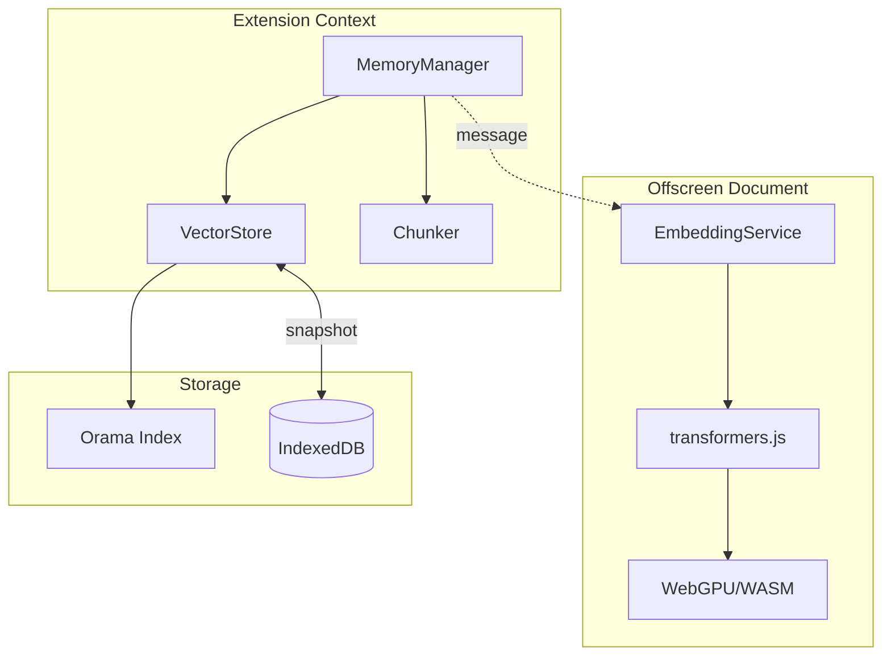

# Design Document: Memory Infrastructure

## Overview

This document describes the technical design for KnowledgeLens's Memory Infrastructure module - a local-first knowledge storage system that enables zero-amnesia learning through vector search, hybrid retrieval, and browser-based embedding computation.

The architecture follows a layered approach:
1. **Persistence Layer** - IndexedDB via `idb` for durable storage
2. **Index Layer** - Orama for vector + full-text hybrid search
3. **Embedding Layer** - transformers.js in Offscreen Document for local inference
4. **Interface Layer** - MemoryManager singleton for unified access

## Architecture



## Components and Interfaces

### 1. IndexedDB Storage (`src/lib/memory/storage.ts`)

Handles low-level IndexedDB operations using the `idb` library.

```typescript
interface MemoryDatabase {
  snapshots: {
    key: string;
    value: {
      id: string;
      data: ArrayBuffer;
      createdAt: number;
      documentCount: number;
    };
  };
  metadata: {
    key: string;
    value: {
      key: string;
      value: unknown;
    };
  };
}

// Core functions
function openDatabase(): Promise<IDBPDatabase<MemoryDatabase>>;
function saveSnapshot(id: string, data: ArrayBuffer, documentCount: number): Promise<void>;
function loadLatestSnapshot(): Promise<{ data: ArrayBuffer; documentCount: number } | null>;
function deleteOldSnapshots(keepCount: number): Promise<void>;
function getMetadata<T>(key: string): Promise<T | null>;
function setMetadata<T>(key: string, value: T): Promise<void>;
```

### 2. Vector Store (`src/lib/memory/vector-store.ts`)

Wraps Orama with persistence and hybrid search capabilities.

```typescript
interface Document {
  id: string;
  content: string;
  embedding: number[];
  sourceUrl: string;
  title: string;
  headingPath: string[];
  createdAt: number;
}

interface SearchOptions {
  limit?: number;
  mode?: 'hybrid' | 'vector' | 'fulltext';
  hybridWeights?: { text: number; vector: number };
  filters?: {
    sourceUrl?: string;
    createdAfter?: number;
    createdBefore?: number;
  };
}

interface SearchResult {
  document: Document;
  score: number;
}

// Orama schema definition
const SCHEMA = {
  id: 'string',
  content: 'string',
  embedding: 'vector[384]', // all-MiniLM-L6-v2 dimension
  sourceUrl: 'string',
  title: 'string',
  headingPath: 'string[]',
  createdAt: 'number',
} as const;

// Core functions
function createVectorStore(): Promise<VectorStore>;
function restoreFromSnapshot(data: ArrayBuffer): Promise<VectorStore>;

interface VectorStore {
  insert(doc: Omit<Document, 'id'>): Promise<string>;
  insertBatch(docs: Omit<Document, 'id'>[]): Promise<string[]>;
  search(query: string, embedding: number[], options?: SearchOptions): Promise<SearchResult[]>;
  remove(id: string): Promise<boolean>;
  getDocumentCount(): number;
  toSnapshot(): Promise<ArrayBuffer>;
}
```

### 3. Embedding Service (`src/offscreen/embedding.ts`)

Runs in Offscreen Document for WebGPU access.

```typescript
interface EmbeddingRequest {
  action: 'compute_embedding';
  texts: string[];
  requestId: string;
}

interface EmbeddingResponse {
  success: true;
  requestId: string;
  embeddings: number[][];
}

interface EmbeddingErrorResponse {
  success: false;
  requestId: string;
  error: string;
}

// Model configuration
const MODEL_ID = 'Xenova/all-MiniLM-L6-v2';
const MODEL_OPTIONS = {
  dtype: 'q8',           // 8-bit quantization for balance of speed/quality
  device: 'webgpu',      // Prefer WebGPU, falls back to WASM
};

// Initialization (called on offscreen document load)
async function initializeEmbeddingService(): Promise<void>;

// Message handler
function handleEmbeddingRequest(request: EmbeddingRequest): Promise<EmbeddingResponse | EmbeddingErrorResponse>;
```

### 4. Chunker (`src/lib/memory/chunker.ts`)

Segments HTML content into semantically meaningful chunks.

```typescript
interface Chunk {
  content: string;
  headingPath: string[];
  tokenCount: number;
  startOffset: number;
  endOffset: number;
}

interface ChunkOptions {
  minTokens?: number;  // Default: 100
  maxTokens?: number;  // Default: 500
  preserveCodeBlocks?: boolean;  // Default: true
}

// Core function
function chunkHtmlContent(html: string, options?: ChunkOptions): Chunk[];

// Internal helpers
function extractTextWithStructure(html: string): StructuredContent;
function splitAtSentenceBoundary(text: string, maxTokens: number): string[];
function isCodeBlock(element: Element): boolean;
```

### 5. Memory Manager (`src/lib/memory/index.ts`)

Singleton facade coordinating all memory operations.

```typescript
interface AddDocumentOptions {
  sourceUrl: string;
  title: string;
}

interface MemoryStats {
  documentCount: number;
  indexSizeBytes: number;
  lastSyncTime: number | null;
  embeddingModelLoaded: boolean;
}

// Singleton instance
let instance: MemoryManager | null = null;

function getMemoryManager(): Promise<MemoryManager>;

interface MemoryManager {
  // Document operations
  addDocument(content: string, metadata: AddDocumentOptions): Promise<string[]>;
  addChunks(chunks: Chunk[], metadata: AddDocumentOptions): Promise<string[]>;
  
  // Search operations
  search(query: string, options?: SearchOptions): Promise<SearchResult[]>;
  
  // Lifecycle
  sync(): Promise<void>;
  getStats(): MemoryStats;
  
  // Internal (exposed for testing)
  _getVectorStore(): VectorStore;
  _getEmbeddingService(): EmbeddingServiceClient;
}
```

### 6. Embedding Service Client (`src/lib/memory/embedding-client.ts`)

Client-side wrapper for communicating with Offscreen Document. Handles Offscreen Document lifecycle, initialization state, and request queuing for concurrent access.

```typescript
type InitState = 'idle' | 'initializing' | 'ready' | 'error';

interface EmbeddingServiceClient {
  computeEmbedding(text: string): Promise<number[]>;
  computeEmbeddings(texts: string[]): Promise<number[][]>;
  isReady(): boolean;
  getState(): InitState;
  preload(): Promise<void>;
}

// Singleton client with initialization guard
let clientInstance: EmbeddingServiceClient | null = null;
let initPromise: Promise<void> | null = null;

function createEmbeddingClient(): EmbeddingServiceClient;
```

#### Offscreen Document Lifecycle Management

The Embedding Client manages the Offscreen Document lifecycle to handle:
1. **Single Instance Guarantee**: Only one Offscreen Document exists at a time
2. **Initialization Queuing**: Requests during initialization are queued and resolved after ready
3. **Crash Recovery**: Automatic recreation if the Offscreen Document crashes

```typescript
// Offscreen Document management
async function ensureOffscreenDocument(): Promise<void> {
  const existingContexts = await chrome.runtime.getContexts({
    contextTypes: ['OFFSCREEN_DOCUMENT'],
    documentUrls: [chrome.runtime.getURL('offscreen/offscreen.html')],
  });
  
  if (existingContexts.length > 0) {
    return; // Already exists
  }
  
  await chrome.offscreen.createDocument({
    url: 'offscreen/offscreen.html',
    reasons: ['WORKERS'], // Required for WebGPU access
    justification: 'Compute text embeddings using WebGPU',
  });
}

// Request queuing during initialization
interface PendingRequest {
  texts: string[];
  resolve: (embeddings: number[][]) => void;
  reject: (error: Error) => void;
}

const pendingRequests: PendingRequest[] = [];

// Process queue after initialization completes
async function processQueue(): Promise<void> {
  while (pendingRequests.length > 0) {
    const request = pendingRequests.shift()!;
    try {
      const embeddings = await sendEmbeddingRequest(request.texts);
      request.resolve(embeddings);
    } catch (error) {
      request.reject(error instanceof Error ? error : new Error(String(error)));
    }
  }
}
```

#### Concurrent Request Handling

Multiple tabs or components may request embeddings simultaneously. The client ensures:
1. **Request Deduplication**: Identical texts in flight are deduplicated
2. **Ordered Response**: Each request receives its corresponding response via requestId
3. **Timeout Handling**: Requests timeout after 30 seconds with proper cleanup

```typescript
// Request tracking
const inflightRequests = new Map<string, {
  resolve: (embeddings: number[][]) => void;
  reject: (error: Error) => void;
  timeout: ReturnType<typeof setTimeout>;
}>();

function generateRequestId(): string {
  return `${Date.now()}-${Math.random().toString(36).slice(2)}`;
}

async function sendEmbeddingRequest(texts: string[]): Promise<number[][]> {
  const requestId = generateRequestId();
  
  return new Promise((resolve, reject) => {
    const timeout = setTimeout(() => {
      inflightRequests.delete(requestId);
      reject(new Error('Embedding request timeout'));
    }, 30000);
    
    inflightRequests.set(requestId, { resolve, reject, timeout });
    
    chrome.runtime.sendMessage({
      action: 'compute_embedding',
      texts,
      requestId,
    });
  });
}

// Response handler (in background script)
chrome.runtime.onMessage.addListener((message, sender, sendResponse) => {
  if (message.action === 'embedding_response') {
    const request = inflightRequests.get(message.requestId);
    if (request) {
      clearTimeout(request.timeout);
      inflightRequests.delete(message.requestId);
      
      if (message.success) {
        request.resolve(message.embeddings);
      } else {
        request.reject(new Error(message.error));
      }
    }
  }
});
```

## Data Models

### IndexedDB Schema

```
Database: knowledgelens_memory

Object Stores:
├── snapshots
│   ├── key: string (snapshot ID, e.g., "snapshot_1704067200000")
│   └── value: { id, data: ArrayBuffer, createdAt, documentCount }
│
└── metadata
    ├── key: string (e.g., "lastSyncTime", "schemaVersion")
    └── value: { key, value: any }
```

### Orama Document Schema

```typescript
{
  id: string,              // UUID v4
  content: string,         // Chunk text content
  embedding: vector[384],  // all-MiniLM-L6-v2 output dimension
  sourceUrl: string,       // Origin page URL
  title: string,           // Page title
  headingPath: string[],   // ["H1 text", "H2 text", ...]
  createdAt: number,       // Unix timestamp
}
```

## Correctness Properties

*A property is a characteristic or behavior that should hold true across all valid executions of a system-essentially, a formal statement about what the system should do. Properties serve as the bridge between human-readable specifications and machine-verifiable correctness guarantees.*


### Property 1: Snapshot Load Performance

*For any* valid snapshot stored in IndexedDB with size up to 100MB, loading and restoring the index SHALL complete within 200ms.

**Validates: Requirements 1.2**

### Property 2: Search Performance

*For any* VectorStore containing up to 10,000 documents and *for any* valid search query, the search operation SHALL return results within 50ms.

**Validates: Requirements 2.2**

### Property 3: Hybrid Search Correctness

*For any* search query executed in hybrid mode, the returned results SHALL include documents that match either the text query (BM25) or the vector similarity, with scores reflecting the configured weights.

**Validates: Requirements 2.3**

### Property 4: Document Storage Round-Trip

*For any* document added to the VectorStore, retrieving that document by ID SHALL return the exact same content, embedding vector, sourceUrl, title, headingPath, and createdAt values.

**Validates: Requirements 2.4**

### Property 5: Search Filter Correctness

*For any* search query with filters (sourceUrl, createdAfter, createdBefore), *all* returned results SHALL satisfy the specified filter criteria.

**Validates: Requirements 2.5**

### Property 6: Index Serialization Round-Trip

*For any* VectorStore instance, serializing to a snapshot and then restoring from that snapshot SHALL produce an index where all documents are retrievable with identical content and search produces equivalent results.

**Validates: Requirements 2.6, 2.7**

### Property 7: Embedding Performance

*For any* text input with fewer than 512 tokens, the Embedding_Service SHALL return a normalized vector within 100ms.

**Validates: Requirements 3.5**

### Property 8: Batch Embedding Correctness

*For any* batch of N texts submitted to the Embedding_Service, the response SHALL contain exactly N embedding vectors, each corresponding to the input text at the same index.

**Validates: Requirements 3.6**

### Property 9: Chunk Semantic Boundaries

*For any* HTML content with semantic elements (headings, paragraphs, lists), the Chunker SHALL produce chunks that respect element boundaries - no chunk shall contain partial elements.

**Validates: Requirements 4.1**

### Property 10: Chunk Heading Preservation

*For any* chunk produced by the Chunker, its headingPath SHALL accurately reflect the heading hierarchy (H1 > H2 > H3...) that contains that chunk in the source document.

**Validates: Requirements 4.2**

### Property 11: Chunk Token Bounds

*For any* chunk produced by the Chunker (excluding code blocks), the token count SHALL be between 100 and 500 tokens inclusive.

**Validates: Requirements 4.3**

### Property 12: Chunk Sentence Splitting

*For any* semantic section exceeding 500 tokens, the Chunker SHALL split it such that each resulting chunk ends at a sentence boundary (period, question mark, exclamation mark, or end of content).

**Validates: Requirements 4.4**

### Property 13: Chunk Content Filtering

*For any* HTML content containing script, style, or advertisement elements, the Chunker output SHALL NOT contain any text from these elements.

**Validates: Requirements 4.5**

### Property 14: Chunk Code Block Preservation

*For any* HTML content containing code blocks (pre, code elements), each code block SHALL appear as a single chunk regardless of its token count.

**Validates: Requirements 4.6**

### Property 15: Auto-Embedding on Document Add

*For any* document added via Memory_Manager.addDocument(), the stored chunks SHALL have valid embedding vectors (non-empty arrays of the correct dimension).

**Validates: Requirements 6.4**

### Property 16: Singleton Consistency

*For any* sequence of calls to getMemoryManager(), all calls SHALL return the same instance with consistent state.

**Validates: Requirements 6.5**

### Property 17: Concurrent Embedding Request Isolation

*For any* set of concurrent embedding requests with different texts, each request SHALL receive its own corresponding embeddings without cross-contamination, regardless of request timing or completion order.

**Validates: Requirements 3.6, 6.4**

### Property 18: Initialization Request Queuing

*For any* embedding requests made before the Embedding_Service is ready, all requests SHALL be queued and processed in order once initialization completes, with no requests lost.

**Validates: Requirements 3.7**

## Error Handling

### IndexedDB Failures

| Error Scenario | Handling Strategy |
|----------------|-------------------|
| Database open fails | Log error, operate in memory-only mode |
| Snapshot save fails | Log error, retry on next sync trigger, continue operation |
| Snapshot load fails | Log error, start with empty index |
| Quota exceeded | Log warning, trigger cleanup of old snapshots |

### Embedding Service Failures

| Error Scenario | Handling Strategy |
|----------------|-------------------|
| Model load fails | Retry with WASM fallback, log error if both fail |
| WebGPU unavailable | Automatic fallback to WASM execution |
| Embedding timeout | Return error, caller decides retry strategy |
| Offscreen document crash | Recreate offscreen document, reinitialize service |

### Chunking Failures

| Error Scenario | Handling Strategy |
|----------------|-------------------|
| Invalid HTML | Use text content extraction fallback |
| Empty content | Return empty chunk array |
| Encoding issues | Normalize to UTF-8, replace invalid chars |

## Testing Strategy

### Property-Based Testing

We will use **fast-check** as the property-based testing library for TypeScript.

Each correctness property will be implemented as a property-based test with:
- Minimum 100 iterations per property
- Custom generators for domain-specific types (Documents, Chunks, HTML content)
- Shrinking enabled for minimal counterexamples

**Test Configuration:**
```typescript
import fc from 'fast-check';

const PBT_CONFIG = {
  numRuns: 100,
  verbose: true,
  seed: Date.now(), // Reproducible with logged seed
};
```

### Unit Tests

Unit tests complement property tests for:
- Specific edge cases (empty inputs, boundary values)
- Error condition handling
- Integration points between components
- API contract verification

### Test Organization

```
tests/lib/memory/
├── storage.test.ts          # IndexedDB operations
├── vector-store.test.ts     # Orama wrapper + properties
├── chunker.test.ts          # HTML chunking + properties
├── embedding-client.test.ts # Offscreen communication
└── index.test.ts            # MemoryManager integration
```

### Generators for Property Tests

```typescript
// Document generator
const documentArb = fc.record({
  content: fc.string({ minLength: 10, maxLength: 2000 }),
  sourceUrl: fc.webUrl(),
  title: fc.string({ minLength: 1, maxLength: 200 }),
  headingPath: fc.array(fc.string({ minLength: 1, maxLength: 100 }), { maxLength: 5 }),
});

// HTML content generator with semantic structure
const htmlContentArb = fc.array(
  fc.oneof(
    fc.record({ type: fc.constant('heading'), level: fc.integer({ min: 1, max: 6 }), text: fc.string() }),
    fc.record({ type: fc.constant('paragraph'), text: fc.string({ minLength: 50, maxLength: 1000 }) }),
    fc.record({ type: fc.constant('code'), content: fc.string({ minLength: 10, maxLength: 500 }) }),
  ),
  { minLength: 1, maxLength: 20 }
).map(elements => elementsToHtml(elements));

// Search query generator
const searchQueryArb = fc.record({
  query: fc.string({ minLength: 1, maxLength: 100 }),
  options: fc.record({
    limit: fc.option(fc.integer({ min: 1, max: 100 })),
    mode: fc.option(fc.constantFrom('hybrid', 'vector', 'fulltext')),
  }),
});
```
